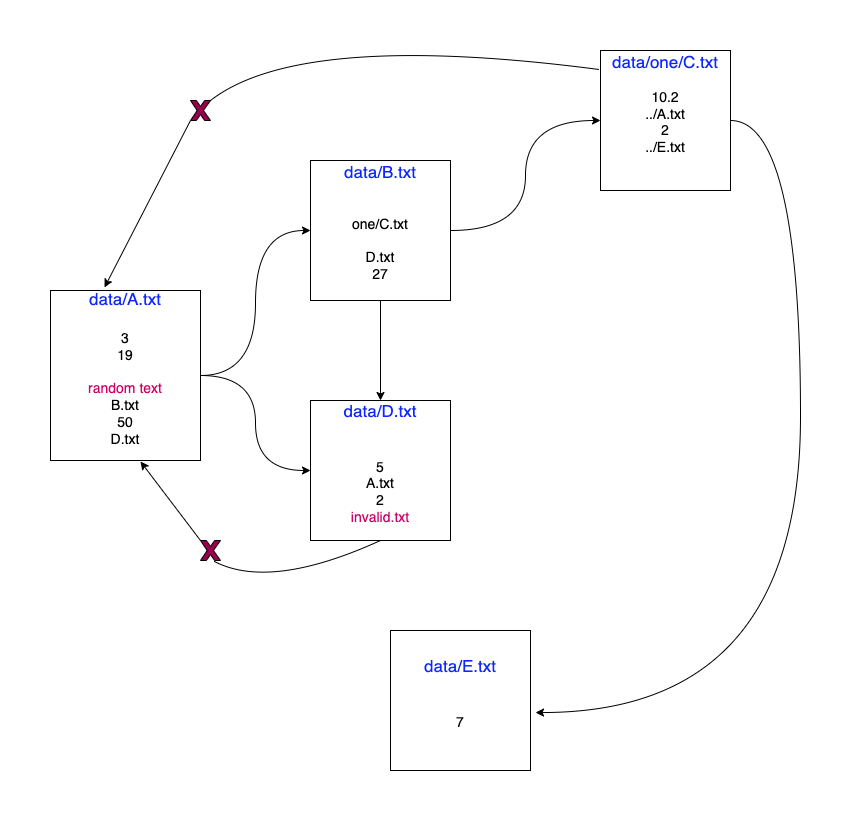

## Test Question
Write a production-ready function that sums the numbers in a file and outputs details of the results. The function will receive as input the path to a single file. Each line of the file will contain either a number or a relative path to another file. For each file processed, output the file path and the sum of all of the numbers contained both directly in the file and in any of the sub files listed in the file (and their sub files, etc).

## Solution flow (recursion)
To handle
* Sum of digits + sum of digits in nested file
* Blank lines in files
* Wrong file name/path
* Files can contain relative path ex: `../A.txt`, `../E.txt`
* Should handle files path for all platforms(Windows/ Mac/ Linux)
* Circular reference (If child called parent)



## Usage
```
npm i
npm start
```

## Output
```javascript
Sum of A.txt = 3 + 19 + sum of B.txt + 50 + sum of D.txt
Sum of A.txt = 22     +     53.2     + 50 +      7
Sum of A.txt = 132.2
```

```javascript
Sum of all numbers: {
  sum: 132.2,
    sumInFiles: {
    'data/A.txt': 132.2,
      'data/E.txt': 7,
      'data/one/C.txt': 19.2,
      'data/D.txt': 7,
      'data/B.txt': 53.2
  }
}
Path traversed:  [
  [ 'data/A.txt' ],
  [ 'data/A.txt', 'data/B.txt' ],
  [ 'data/A.txt', 'data/B.txt', 'data/one/C.txt' ],
  [ 'data/A.txt', 'data/B.txt', 'data/one/C.txt', 'data/E.txt' ],
  [ 'data/A.txt', 'data/B.txt', 'data/D.txt' ],
  [ 'data/A.txt', 'data/D.txt' ]
]
```
